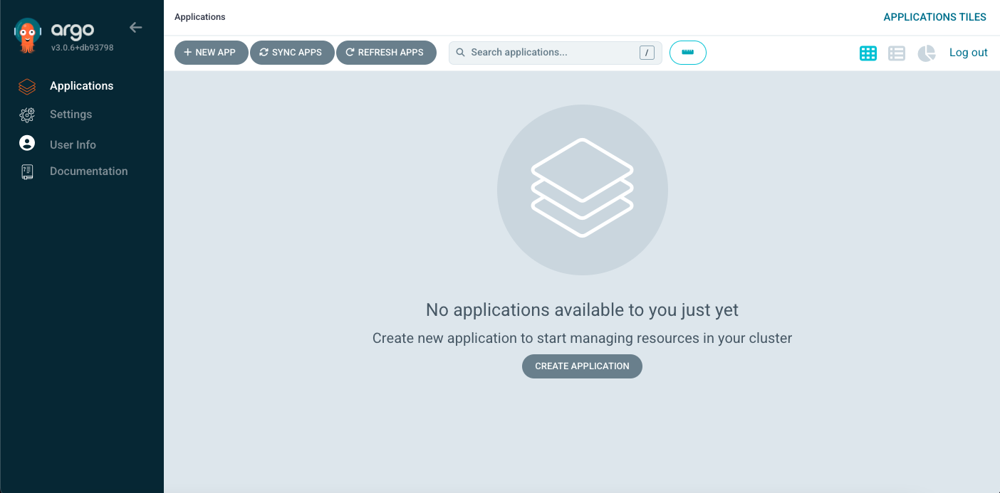
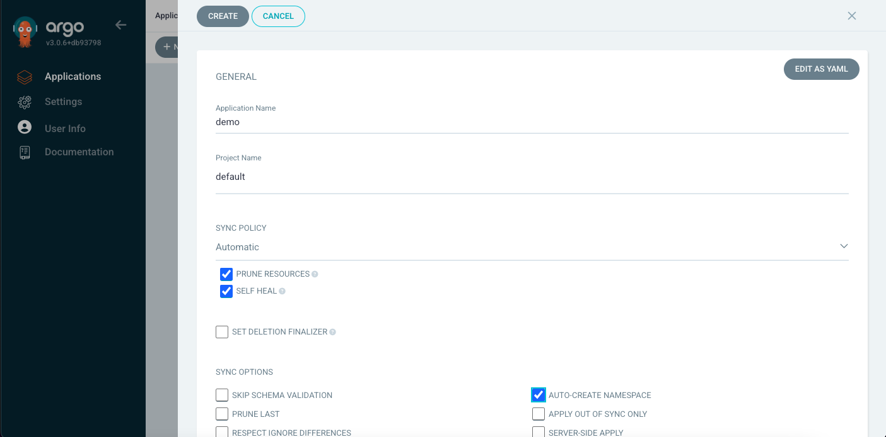

# MVP: ArgoCD App creation

### How to create ArgoCD App with automatic synchronization

1. Log into ArgoCD WebUI and click on ***New App*** (or ***Create Application***):

2. Set these fields:

    ***Application Name*** --> demo
   
    ***Project Name***     --> default
   
    ***SYNC POLICY***      --> Automatic

    ***PRUNE RESOURCES*** checkbox --> ✅

    ***SELF HEAL***       checkbox --> ✅

  
    
