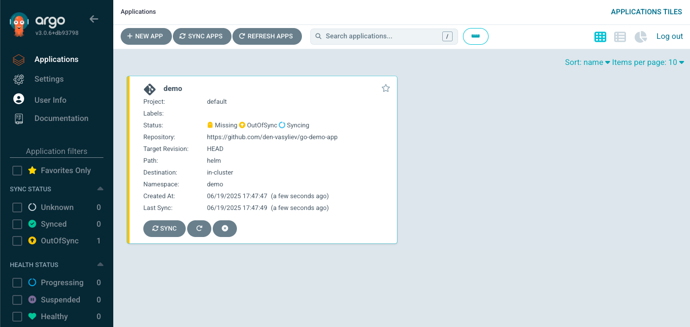
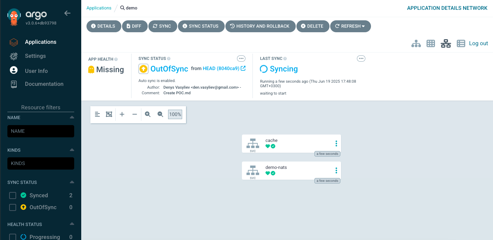
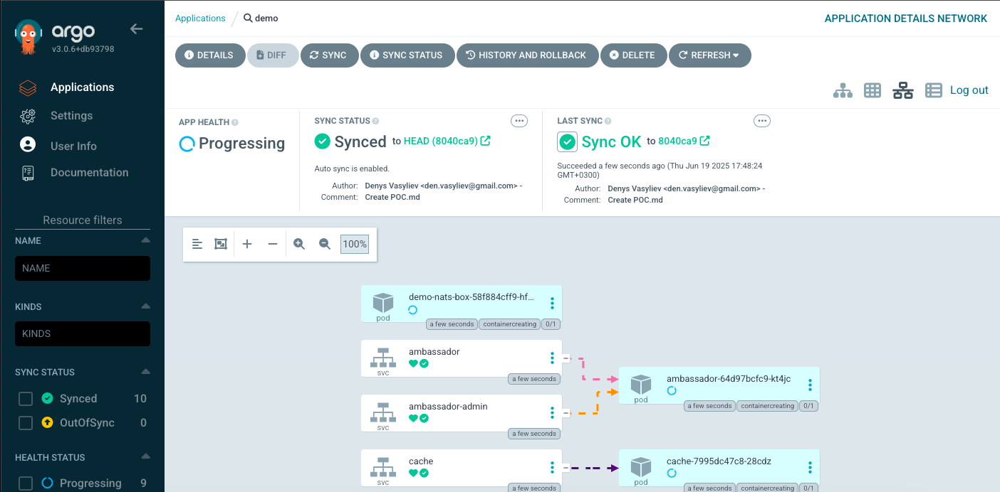
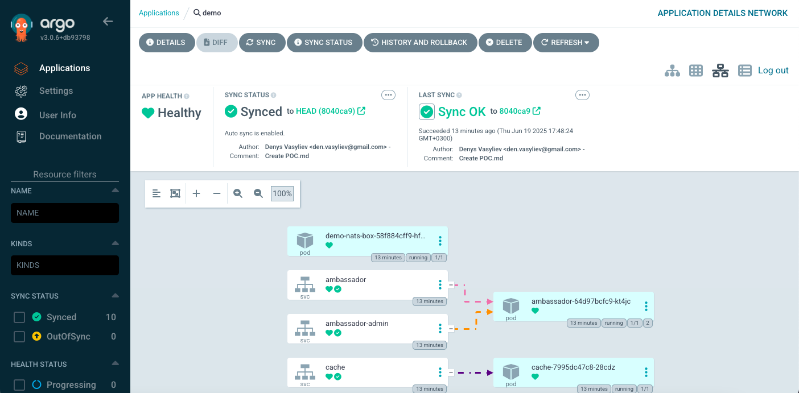
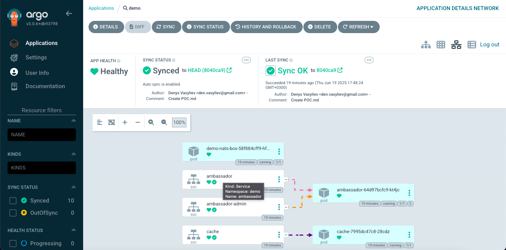
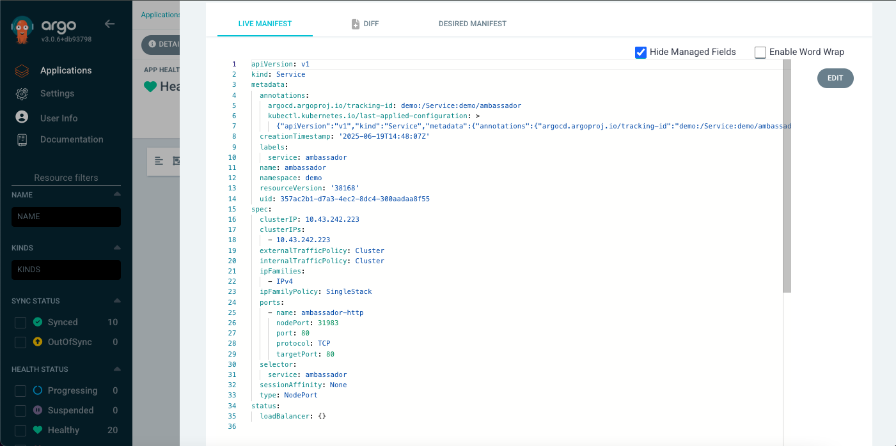
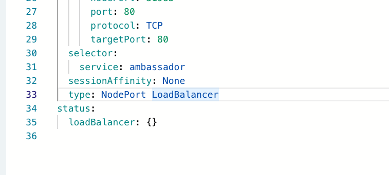
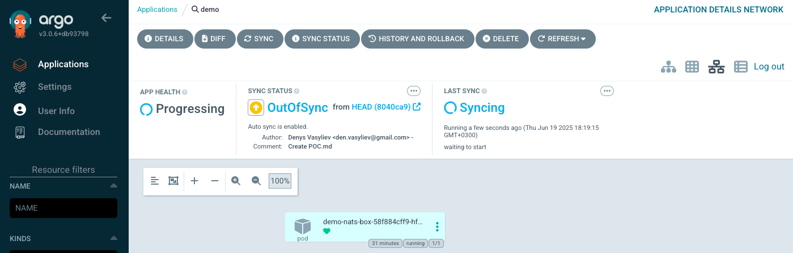
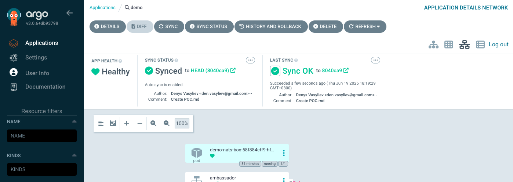

# MVP: ArgoCD App creation

### How to create ArgoCD App with automatic synchronization

1. Log into ArgoCD WebUI and click on ***New App*** (or ***Create Application***):

2. Set these fields in ***GENERAL*** block:

    ***Application Name*** --> demo
   
    ***Project Name***     --> default
   
    ***SYNC POLICY***      --> Automatic

    ***PRUNE RESOURCES*** checkbox --> ✅

    ***SELF HEAL***       checkbox --> ✅

    ***AUTO-CREATE NAMESPACE      -->  ✅

3. Set these fields in ***SOURCE*** block:

    ***Repository URL*** --> https://github.com/den-vasyliev/go-demo-app
   
    ***Revision***       --> HEAD

    ***Path***           --> helm

4. Set these fields in ***DESTINATION*** block:

    ***Cluster URL***  --> https://kubernetes.default.svc
   
    ***Project Name*** --> demo

5. Click on ***CREATE*** button --> ***demo*** application will be created and ***sync*** process will be started automatically:

6. Click on ***demo*** application to see/check ***LAST SYNC/SYNC/APP HEALTH*** statuses - wait till they get ***green*** status:

7. To test ArgoCD App with automatic synchronization, click for examply on ***ambassador*** service:

and scroll down till the ***LIVE MANIFEST***:

8. Click on ***EDIT*** and change for example service type from ***NodePort*** --> ***LoadBalancer*** ; click on ***SAVE*** button and close the window:

9. Now you can see that after such changes automatic synchronization process was started and ArgoCD tries to get a state equal to the state described in a source repo:

  
    
