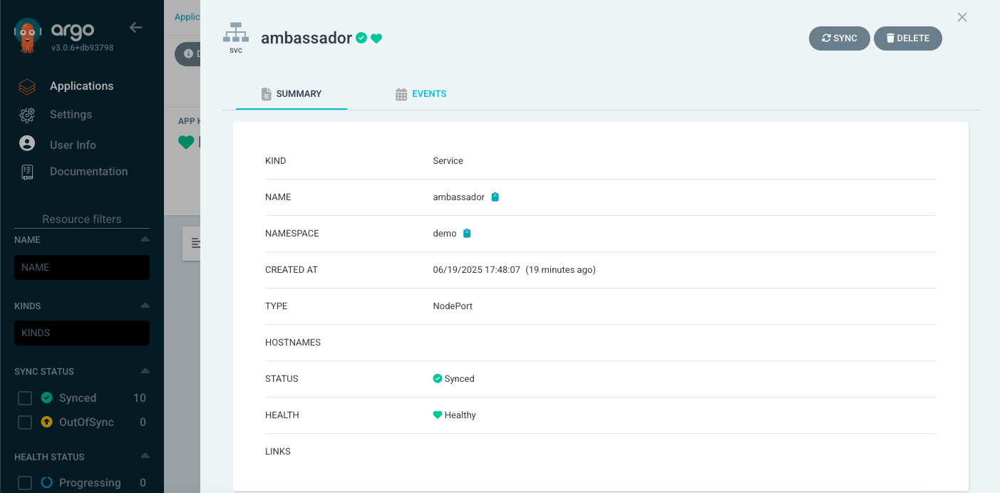
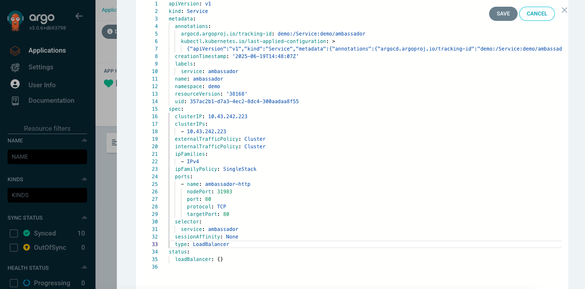

# MVP: ArgoCD App creation

## How to create ArgoCD App with automatic synchronization


1. Log into ArgoCD WebUI and click on ***New App*** (or ***Create Application***):


2. Set these fields in ***GENERAL*** block:

    ***Application Name*** --> demo
   
    ***Project Name***     --> default
   
    ***SYNC POLICY***      --> Automatic

    ***PRUNE RESOURCES*** checkbox --> ✅

    ***SELF HEAL***       checkbox --> ✅

    ***AUTO-CREATE NAMESPACE      -->  ✅


3. Set these fields in ***SOURCE*** block:

    ***Repository URL*** --> https://github.com/den-vasyliev/go-demo-app
   
    ***Revision***       --> HEAD

    ***Path***           --> helm


4. Set these fields in ***DESTINATION*** block:

    ***Cluster URL***  --> https://kubernetes.default.svc
   
    ***Project Name*** --> demo


5. Click on ***CREATE*** button --> ***demo*** application will be created and ***sync*** process will be started automatically:


6. Click on ***demo*** application to see/check ***LAST SYNC/SYNC/APP HEALTH*** statuses - wait till they get ***green*** status:


7. To test ArgoCD App with automatic synchronization, click for examply on ***ambassador*** service:




and scroll down till the ***LIVE MANIFEST***:


8. Click on ***EDIT*** and change for example service type from ***NodePort*** --> ***LoadBalancer*** ; click on ***SAVE*** button and close the window:




9. Now you can see that after such changes automatic synchronization process was started and ArgoCD tries to get a state equal to the state described in a source repo:


## Test run of ArgoCD Demo Application:


Use ***port-forward*** to forward local port ***8088*** to ArgoCD Application port ***80*** :
```
kubectl port-forward -n demo svc/ambassador 8088:80 &
```

Download some test image:
```
wget -O ./g.png  https://www.google.com/images/branding/googlelogo/1x/googlelogo_color_272x92dp.png
```

Send test image using ***curl** utility to an application endpoint:
```
$ curl -F 'image=@g.png' localhost:8088/img/

Handling connection for 8088
  .;1tttt1i.                               ;:
 if1:....:i.                              .1;
iL;             ,;;;:    .;ii;,    :ii;:;, 1;  ,;;:,
ff.   .1tt11:. 11:::11, if1::if1 .tf;:;tL1 1; i1::;t1.
;Li       .tL.it     t1,Li    ;L,,L.    fi 1:.t;:;;:,.
 ;fti:,,,;tf: :ti,.,;t:.tf;,,:ff..ft:,,iLi 1; 1t;,.::
   :i1111i:    .;iii;,   :1111;.  .;11i;L1 ;, .:;iii:
                                 .11,,,1L:
```


  
    
